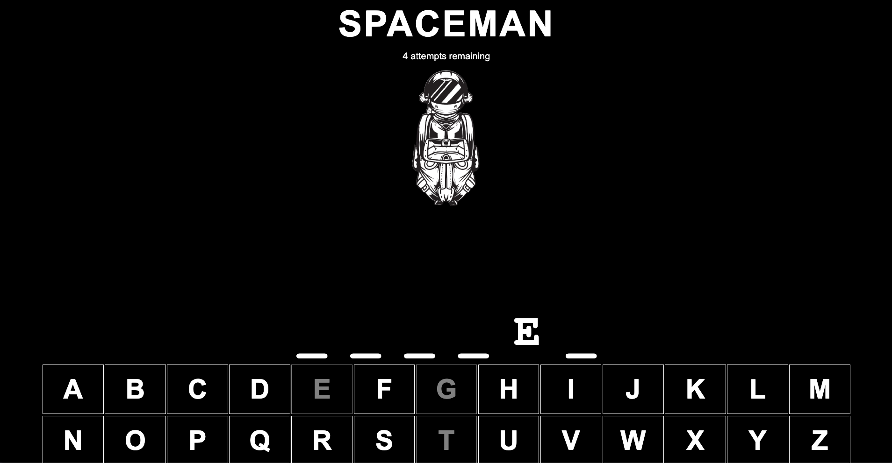

# Spaceman - The Galactic Hangman Game

Welcome to Spaceman, a twist on the classic hangman game set in the vast expanse of space! This game is designed using HTML, CSS, and JavaScript to bring you an interstellar word-guessing adventure. Get ready to save your astronaut from getting lost in space by guessing the right words!

## Game Description

In Spaceman, your mission is to guess the hidden word before your astronaut runs out of oxygen. Each incorrect guess brings your spaceman closer to being lost in the cosmos. Correct guesses, on the other hand, will reveal letters of the mysterious word and bring your astronaut closer to safety.

## Features

- **Cosmic Interface**: A space-themed user interface that takes you on a journey across the stars.
- **Dynamic Word Bank**: A vast collection of words that makes every game a new adventure.
- **Attempts Counter**: Keep track of your remaining guesses as you try to save your spaceman.
- **Letter Guessing**: Click or type to guess letters in the word.
- **Win/Lose Notifications**: Instant feedback on your game status with engaging animations.

## How to Play

1. **Start the Game**: Load the game in your browser to start your space adventure.
2. **Guess Letters**: Click on the alphabet on your screen or use your keyboard to guess letters.
3. **Watch Your Steps**: Each wrong guess will deplete your astronaut's oxygen level.
4. **Save Your Spaceman**: Correctly guess the word before your guesses run out to win.

## Installation

No installation required! Simply clone the repository to your local machine and open the `index.html` file in your favorite browser to start playing.

```bash
git clone https://github.com/your-username/spaceman.git
cd spaceman
open index.html
```

## Technologies Used

- **HTML**: For structuring the game content.
- **CSS**: For styling and animating the game interface.
- **JavaScript**: For game logic and interactivity.

## Contributing

Feel free to fork this repository and submit pull requests to contribute to the development of Spaceman. For major changes, please open an issue first to discuss what you would like to change.

## License

This project is licensed under the MIT License - see the [LICENSE.md](LICENSE.md) file for details.

---

Embark on this cosmic journey and enjoy the thrill of Spaceman - where every guess makes a difference between victory and drifting away into the galaxy! 🌌🚀👨‍🚀

# Icebox
- Make accomodations for repeating letters